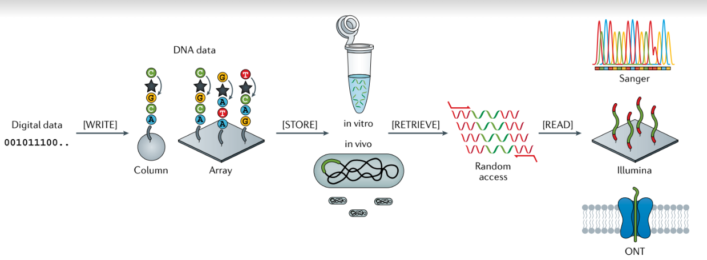
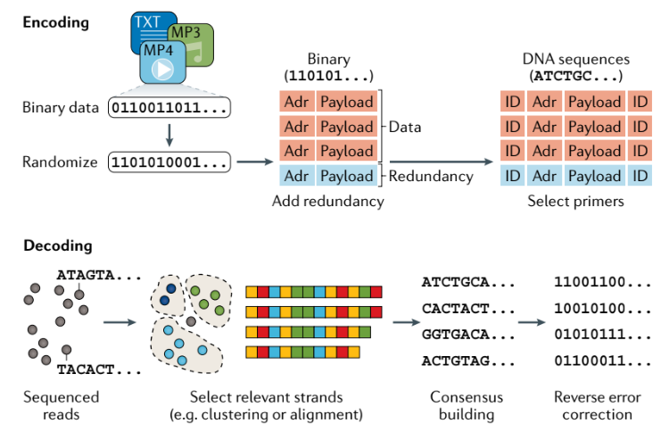

# Information

**Paper link:** https://www.nature.com/articles/s41576-019-0125-3
**First author:**  Luis Ceze - https://scholar.google.co.uk/citations?user=KzESVKwAAAAJ&hl=en&oi=ao

---
# Main topics and ideas

- Molecular data storage is an attractive alternative for dense and durable information storage, which is sorely needed to deal with the growing gap between information production and the ability to store data.

- Most data generated are discarded, but a portion still needs to be stored. Unfortunately, based on these trends, the portion that can be retained is declining. This is a strong motivator for research in new storage media.

- Density, durability and energy cost at rest are primary factors for archival storage, which aims to store vast amounts of data for long-term, future use.

- For example, using DNA for data storage offers density of up to 1018 bytes per mm3, approximately six orders of magnitude denser than the densest media available today. The sheer density also facilitates preservation of the data in molecules for long periods of time at low energy costs.

- DNA is time tested by nature, with DNA sequences having been read from fossils thousands of years old. When kept away from light and humidity and at reasonable temperatures, DNA can last for centuries to millennia compared with decades, the typical lifetime for archival storage media such as commercial tape and optical disks.

- The basic process in DNA data storage involves encoding digital information into DNA sequences (encoding), writing the sequences into actual DNA molecules (synthesis), physically conditioning and organizing them into a library for long-term storage, retrieving and selectively accessing them (random access), reading the molecules (sequencing) and converting them back to digital data (decoding).

---
# Overview of the major steps of digital data storage in DNA:

1.  Computer algorithm maps strings of bits into DNA sequences.
2.  The DNA sequences are then machine synthesized (write), thereby generating many physical copies of each sequence.
3.  After synthesis, the resulting DNA material can be cloned and stored within a biological cell (in vivo) or, more commonly, stored in vitro, such as being frozen in solution or dried down for protection from the environment (store).
4.  DNA data requested to be read can be selectively retrieved from the DNA pool in a process called random access (retrieve). Random access within DNA data pools can be accomplished with PCR-based enrichment with primer pairs that map to specific data items generated during the encoding process.
5.  Automated sequencing instruments are used to generate a set of reads that correspond to the molecules they can detect (read). The most common sequencing methods are Sanger (low-throughput) and sequencing-by-synthesis instruments (high-throughput, for example, by Illumina). More recently, nanopore sequencing (for example, from Oxford Nanopore Technologies (ONT)) has been used for real-time data reading.

It is unlikely that in vivo DNA data storage will be a viable alternative for general mainstream digital data storage because of its lower overall storage density owing to the relatively large size of cells, in addition to the extra complexity of modifying and/or adding to the natural DNA within living cells.

---
# Encoding - decoding process

- Reed–Solomon codes date back to the 1960s. They are commonly used for DNA data storage purposes but have also been used in a variety of other applications such as optical disks (such as compact, digital video and Blu-ray disks), 2D visual codes (such as quick response (QR) codes) and data transmission (such as WiMax). The basic idea in Reed–Solomon codes is to map the original data into a set of symbols, which is a fairly small basic unit of encoded data. Symbols map to coefficients in a system of linear equations, whose solutions are mapped back to the original data. These codes can correct two issues: a missing original symbol (called an erasure) and a corrupted original symbol (called an error).

- Methods that achieve higher logical density may require higher physical redundancy, hence potentially leading to lower overall physical density. Higher logical redundancy, though, implies that more unique DNA sequences need to be synthesized and hence could lead to higher costs and lower bit-writing throughput.

- Scaling up DNA data storage requires a method for selectively reading pieces of data, referred to as random access in the computer science field. This is because having to sequence all the DNA in a pool to retrieve the desired data item is impractical owing to performance and cost reasons. Fortunately, selective extraction of DNA fragments is common practice in molecular biology work. Two popular methods are PCR amplification and magnetic bead extraction.

- Organick et al. provide an estimate that a DNA pool provisioned for PCR-based random access scales to the order of terabytes of data, which is sizeable but not enough to deliver on the promises of molecular data storage. To go beyond that limit, it may be necessary to create a library of physically isolated pools that are retrieved on demand. This needs to be done in a way that does not sacrifice much density and is currently an active area of research.

---
# Challenges to mainstream adoption

- It is likely that access latency (time to read) will continue to be high (minutes to hours) in the short and medium terms, but as long as bandwidth (throughput of data writing and reading) is high, in vitro DNA data storage can coexist with or potentially replace commercial media for archival data storage applications. This is because archival storage can tolerate higher latencies and would benefit considerably from smaller footprints and lower energy costs of data at rest. (In computers, archival storage is storage for data that may not be actively needed but is kept for possible future use or for record-keeping purposes. Archival storage is often provided using the same system as that used for backup storage.)

- On the cost gap, tape storage cost about US$16 per tera-byte in 2016 and is going down approximately 10% per year. DNA synthesis costs are generally confidential, but leading industry analyst Robert Carlson estimates the array synthesis cost to be approximately US$0.0001 per base, which amounts to US$800 million per tera-byte or 7–8 orders magnitude higher than tape.

- There are multiple challenges to automation of these systems to enable their use for large-scale archival storage. Such environments typically operate with minimal human interference. Most DNA manipulations outside of synthesis and sequencing are still being performed by humans in laboratory environments.

---

- Living organisms have used DNA to store and propagate their biological blueprints for billions of years. The human genome, for instance, contains slightly more than 3 billion bp of DNA.

- Another class of emerging strategies for in vivo recording and data storage systems harnesses components of the recently discovered CRISPR–Cas system (very disruptive technology!).

- In comparing in vitro and in vivo DNA data storage, it is clear that in vitro storage is currently the most practical form of storage with regard to cost, scalability and stability. However, the in vivo storage systems can be used as biological recording devices that are better suited to collecting new data than preserving digital data already in hand. As the field of synthetic biology continues to mature, in vivo data storage may yet provide answers to lingering drawbacks of in vitro storage methods.

- As research into DNA data storage continues to progress, we can anticipate technological innovations that are tailored for DNA data storage, which promise to gradually decrease barriers to its mainstream adoption.

---
# Score: 8

-   In terms of innovation it is an extremely relevant topic and has the potential to define the way we will store data in the not so distant future
-   The article is written in a way that appeals to readers with and without knowledge in the area, which is extremely difficult to achieve
-   Very well shown the advantages and disadvantages of either in vitro or in vito data storage in relation to the means that exist today to do this storage
-   The topic is in my opinion one of the most interesting I have ever read, it is simply amazing the impact this could have on our future.
-   Although it is a very good article, in some parts I got completely lost because it is a bit dense, which is normal due to its technical complexity.